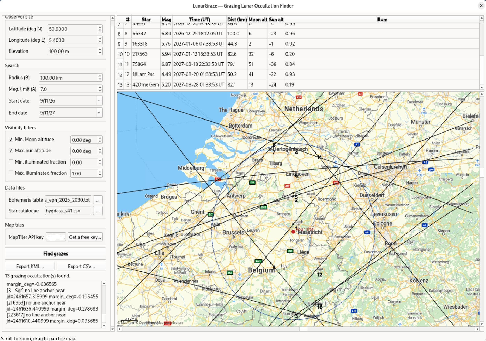

# LunarGraze

A C++/Qt desktop rewrite of `../graze_finder/graze_finder.py`: find and plot
grazing lunar occultations near any location on Earth, for any star
magnitude limit and date range, on a **zoomable, pannable map** (OSM-derived
map tiles) with the traced graze lines drawn on top -- instead of a static
PNG.

(This project was previously named `graze_gui`; the executable, source
directory and everything else have been renamed to **LunarGraze**. If
you're upgrading from an older `graze_gui` build, your saved MapTiler API
key is carried over automatically the first time you run the new binary.)

Same method, same caveats, same cross-check against the printed *Sterrengids
2026* almanac and against `graze_finder.py` itself (see the method section
below and `../graze_finder/README.md`) -- this is a from-scratch C++ port of
that script's algorithm, not a wrapper around it. **This tool is for
scouting** -- "does a graze line cross near me, roughly" -- not for planning
an actual observation; see "Getting accurate predictions" below for the
real thing.

See `DEVELOPMENT.md` for the full working history behind this tool -- bugs
found and fixed while porting the algorithm to C++ (including a real
missed-event case), what's been learned about the accuracy limits of the
spherical-Moon model, and the map-tile saga that ended in a one-line Qt
signal/slot bug. Worth reading before touching `src/grazecore.cpp` or
`src/mapview.cpp`.

## Made with Claude

Made with Claude Sonnet 5 High

## Screenshots



## Quick start (Linux)

```
sudo apt install qt6-base-dev cmake g++      # Debian/Ubuntu; see "Other platforms" below
cd LunarGraze
mkdir build && cd build
cmake -DCMAKE_BUILD_TYPE=Release ..
cmake --build . -j4
ln -sf ../hygdata_v41.csv ../area_eph_2025_2030.txt .   # so the GUI's default paths just work
./LunarGraze
```

The window has search parameters on the left (site lat/lon, radius B,
magnitude limit A, date range, visibility filters) and, on the right, a
results table above a zoomable/pannable map. Scroll to zoom, drag to pan.
Click a result row to centre the map on that graze line. Hover a line for
its full circumstances. A scale bar is drawn in the bottom-left corner of
the map, updating as you zoom.

Once a search finds at least one event, the **Export KML...** and
**Export CSV...** buttons under "Find grazes" become enabled:

* **KML** opens directly in Google Earth (desktop or [earth.google.com](https://earth.google.com))
  and imports cleanly into Google My Maps or most GIS tools (QGIS, etc).
  It includes a placemark for your observer site, your search radius drawn
  as a ring, and one line placemark per graze event with its circumstances
  (star, magnitude, time, distance, Moon/Sun altitude, illuminated
  fraction) in the placemark's description -- click a line in Google Earth
  to see them.
* **CSV** writes the same table shown in the results panel, one row per
  event, in the same column layout as `graze_core_test --csv-out` /
  `graze_finder.py`'s CSV output, for spreadsheets or further processing.

This directory is self-contained -- unzip it anywhere and build it, no
sibling `moon-graze` checkout required. (`src/frames.{hpp,cpp}`,
`src/time_utils.{hpp,cpp}`, `src/star.hpp` and `src/vec3.hpp` are bundled,
unmodified copies of the same files from the main moon-graze C++ engine's
`include/`/`src/`, kept in sync by hand.)

Everything needed to run is bundled in this directory:

* `hygdata_v41.csv` -- the same HYG bright-star catalogue `graze_finder.py`
  uses (astronexus/HYG-Database on GitHub; Hipparcos/Yale BSC/Gliese).
* `area_eph_2025_2030.txt` -- a baked Moon+Sun position table (JPL DE421)
  covering 2025-01-01..2030-06-01, ~8 MB. Regenerate/extend it with
  `gen_area_ephemeris.py` (see below) for other date ranges.

### Map tiles need a free API key

Map tiles come from [MapTiler](https://www.maptiler.com/) on demand and are
cached to disk (`QStandardPaths::CacheLocation`, e.g.
`~/.cache/LunarGraze/tiles/` on Linux) -- the app needs network access the
first time it draws a given area, not after.

This used to point at the public `tile.openstreetmap.org` demo server
directly, but OSM's operations team has tightened enforcement and it now
403s this kind of app outright regardless of User-Agent/caching compliance
(see [wiki.osmfoundation.org/wiki/Blocked_tiles](https://wiki.osmfoundation.org/wiki/Blocked_tiles)
and [operations.osmfoundation.org/policies/tiles/](https://operations.osmfoundation.org/policies/tiles/)).
MapTiler's terms explicitly support exactly this use case -- an app
distributed to end users who each supply their own free key -- so that's
what it uses instead:

1. Sign up for free at [maptiler.com/cloud](https://www.maptiler.com/cloud/)
   (no credit card; the "Get a free key..." button in the app's "Map tiles"
   section opens this page for you). The free tier is generous (100,000
   tile requests/month at time of writing).
2. Copy your API key from the account dashboard and paste it into the "Map
   tiles" field in the app. It's saved locally (`QSettings`, e.g.
   `~/.config/moon-graze/LunarGraze.conf` on Linux) so you only do this
   once, and is never sent anywhere except MapTiler's own tile requests.

Without a key, the map area shows a clear on-canvas message saying so
(and the app makes no tile requests at all -- no point hammering a server
with requests you already know will be rejected) rather than staying
blank with no explanation, which is what used to happen silently.

### Diagnosing map problems

A red banner across the top of the map and lines in the log panel say why
tiles aren't loading, if they aren't (this used to fail silently). Beyond a
missing API key (above), common causes:

* **No route to `api.maptiler.com`** -- corporate firewall, VPN
  split-tunnelling, or simply no internet from this machine. The app calls
  `QNetworkProxyFactory::setUseSystemConfiguration(true)` at startup so it
  picks up your OS/browser's configured HTTP(S) proxy automatically; if you
  still see a connection error, check that a browser on the same machine
  can reach that host.
* **TLS/SSL backend missing** -- an error mentioning SSL/TLS/handshake
  usually means Qt's OpenSSL backend or the `libssl`/CA-certificates
  packages aren't installed (`sudo apt install libssl3 ca-certificates` on
  Debian/Ubuntu, or the equivalent for your distro), which silently breaks
  every `https://` request.
* Once a tile does load it's cached to disk, so a flaky connection that
  recovers will fill in tiles from then on without needing a restart.
* Want a different provider entirely (self-hosted, Stadia Maps, etc.)?
  Change `kTileUrlTemplate` in `src/mapview.cpp` and the key-handling in
  `MapView::requestTile()`/`setApiKey()`.

## Regenerating / extending the ephemeris table

`area_eph_2025_2030.txt` only covers 2025-2030. To search outside that
range, bake a new table:

```
pip install jplephem
pip download --no-deps -d /tmp/de421pkg de421      # see note below if this fails
tar xzf /tmp/de421pkg/de421-*.tar.gz -C /tmp/de421pkg
PYTHONPATH=/tmp/de421pkg/de421-2008.1 python3 gen_area_ephemeris.py \
    --start 2030-01-01 --end 2035-01-01 --step-minutes 60 \
    --out area_eph_2030_2035.txt
```

then point the GUI's "Ephemeris table" field at the new file (the "..."
button opens a file picker). `pip install de421` sometimes fails to build on
modern Python due to an old-setuptools sdist issue -- the `pip download` +
manual extract above works around that; see `gen_area_ephemeris.py`'s
header docstring for more detail. DE421 itself covers 1899-12-04 to
2100-02-08; the script warns (but doesn't refuse) if your range falls
outside that.

A 5-minute step-size empirical test (see project history) showed
Lagrange-4 interpolation of the baked table has sub-milliarcsecond error
even at a 2-hour step -- the default 60-minute step has enormous headroom;
you don't need a finer one for accuracy, only ever a coarser one to shrink
the file for a much longer date range.

## What it does (method)

Identical algorithm to `graze_finder.py`, ported statement-for-statement
where practical:

1. Filters the star catalogue to V <= the requested magnitude limit and
   within 8 degrees of the ecliptic (the only stars the Moon's
   5.145-degree-inclined orbit can ever occult).
2. Coarse-scans the requested date range (DE421 Moon+Sun position, 4-point
   Lagrange-interpolated from the baked table) for every close topocentric
   approach of each candidate star at your site.
3. Refines each approach to the true minimum separation (golden-section
   search -- unimodal-function minimization, the same technique that took
   the Python tool from a brute-force scan to about a second per year of
   search).
4. For approaches whose margin (separation minus the Moon's topocentric
   angular radius) is small enough to plausibly matter, traces the actual
   graze line -- the locus where the star sits exactly on the Moon's limb
   -- across a spread of longitudes around your site, using a from-scratch
   C++ Brent's-method root finder (no external numerics dependency) plus
   Newton-stepped latitude prediction between points.
5. Keeps lines that pass within the requested radius, and hands them to the
   map widget to draw.

## Differences from graze_finder.py worth knowing about

* **Geometry engine**: `graze_finder.py` uses PyEphem, which reduces both
  Moon and star to the true equator/equinox **of date** (full precession +
  nutation + aberration). This C++ port instead keeps both in the DE421
  ephemeris's native ICRF/J2000 frame and only applies proper motion +
  annual aberration to the star (see `../../include/star.hpp` and
  `../../include/frames.hpp`, unchanged from the original moon-graze C++
  engine) -- precession/nutation "mostly cancels" for a *relative*
  star-to-Moon separation, but not exactly. In practice this leaves a
  residual of a few arcseconds, occasionally enough to matter for a
  genuinely knife-edge graze (see the next point).
* Because of that residual, `bracket_and_root()` (the latitude-marching
  line search) does extra work `graze_finder.py` doesn't need: it
  re-verifies the previous sample with the *current* step's search window
  before comparing signs, and bisects between same-sign samples that are
  both suspiciously close to zero, specifically to catch a very narrow
  (well under 0.1 deg) negative-margin band that a plain step march can
  jump clean over. This was found and fixed by cross-checking a real event
  (Maia, Dec 2026, from the Diepenbeek/Belgium demo in this project's
  history) against `graze_finder.py` line by line -- both tools now agree
  on that event's line to within a few km and a few arcseconds of Moon/Sun
  altitude.
* Cross-checked (this session): full-year, no-filter runs at the same
  site/magnitude/radius from both tools find the **same 9 events**, same
  stars, times agreeing to about a second, distances-to-site agreeing to
  single-digit km, moon/sun altitude and illuminated fraction agreeing to a
  few tenths of a degree / hundredths.
* No country-border overlay (the Python tool's `countries.geojson`) --
  superseded by real OSM map tiles, which show much more useful context
  (roads, towns, coastlines) than vector borders did.

## Caveats (same as graze_finder.py, read before trusting a specific plan)

* Spherical-Moon geometry, no lunar limb topography (DEM) -- fine for
  "does a graze line cross within N km of me", not for the flash-timing
  precision the moon-graze C++ engine (`../../src`) targets once you
  already have one specific known event with real coordinates.
* No atmospheric refraction (matches the geometric convention IOTA/VVS
  tables use).
* Double/binary companions of catalogue stars aren't modelled separately.
* The traced line has a residual of order arcseconds to a few tens of
  arcseconds (a few hundred metres to ~1 km) at this session's tested
  settings -- for "which side of the border", not a specific back garden.
  Cross-check a specific event against IOTA/Occult4 before treating exact
  timing/path as final.

## Getting accurate predictions

LunarGraze (like `graze_finder.py` before it) is a **scouting tool**: it
answers "is there a graze line worth planning around near me this year",
quickly, for any site and any magnitude limit, drawn on a real map. It
deliberately trades away lunar-limb topography (DEM) for that speed and
simplicity -- see "Caveats" above. That's the wrong trade once you've found
a specific event you actually want to observe, because for a graze the
Moon's real, mountain-and-valley limb profile is the whole point: it's what
turns a single grazing line into a series of star disappearances and
reappearances as the star ducks behind lunar peaks and shines through
valleys, and only a DEM-aware prediction gets *that* right. For an actual
observing plan, cross-check against these IOTA (International Occultation
Timing Association) resources instead:

* **[IOTA's Annual Prediction Maps](https://occultations.org/observing/occultation-predictions/)**
  -- published every year (e.g. the
  [2026 North American grazing occultation maps and totals tables](https://occultations.org/publications/rasc/2026/nam26grz.htm),
  compiled from the Royal Astronomical Society of Canada's *Observer's
  Handbook* data by Eberhard Riedel and David Dunham) give pre-computed
  graze lines, local circumstances and observing notes for the year ahead,
  region by region. Start here to see what's already been predicted near
  you before reaching for software.
* **[Occult (Occult4)](https://occultations.org/observing/software/occult/)**
  -- IOTA's own free Windows prediction program (by Dave Herald), described
  by IOTA as "our primary software program for predicting the circumstances
  of many types of astronomic occultations," including grazing lunar
  occultations, total lunar occultations, and asteroid occultations. Unlike
  this tool, Occult uses real lunar limb elevation data, so it can predict
  the actual sequence of disappearances/reappearances along a graze line,
  not just where the line falls.
* **[GrazPrep](http://grazprep.com/)** -- a free tool built specifically for
  grazing occultations: given a known graze event, it generates the
  detailed local map and limb profile you'd actually take out into the
  field, at a level of precision beyond what LunarGraze's spherical model
  can offer.

The practical workflow this project has settled on: use LunarGraze (or
`graze_finder.py`) to search broadly and get a feel for what's out there
near a site, then look up or compute the specific events you care about
with IOTA's maps, Occult4 and/or GrazPrep before finalizing where to stand.

## Project layout

```
LunarGraze/
  CMakeLists.txt          two targets: graze_core_test (headless CLI,
                           no Qt -- used to verify graze_core against
                           graze_finder.py) and LunarGraze (the Qt app,
                           built only if Qt6 Widgets+Network are found)
  LICENSE                  GPL-3.0-or-later, full text
  gen_area_ephemeris.py    bakes the Moon+Sun ephemeris table (offline,
                           one-time/occasional; not needed at GUI runtime)
  hygdata_v41.csv          bundled star catalogue
  area_eph_2025_2030.txt   bundled default ephemeris table
  src/
    areaephem.{hpp,cpp}    loads+interpolates the baked ephemeris table
    starcatalog.{hpp,cpp}  HYG catalogue loader
    grazecore.{hpp,cpp}    the port of graze_finder.py's algorithm
    main_cli.cpp           headless CLI harness (graze_core_test)
    mapview.{hpp,cpp}      zoomable/pannable OSM-tile QGraphicsView map
    mainwindow.{hpp,cpp}   Qt main window, threaded search, KML/CSV export
    main.cpp               Qt app entry point
    frames.{hpp,cpp}       bundled copy of the main engine's reference-frame
    time_utils.{hpp,cpp}   code (unmodified) -- see note above; makes this
    star.hpp                directory buildable on its own
    vec3.hpp
```

`graze_core` (the static library built from `areaephem.cpp`,
`starcatalog.cpp`, `grazecore.cpp`, plus the bundled, unmodified
`frames.cpp` and `time_utils.cpp`) has no Qt dependency at all -- it's a
portable geometry/search library. The CLI (`graze_core_test`) mirrors
`graze_finder.py`'s own CLI output format on purpose, so the two can be
diffed directly against each other.

## Other platforms

* **macOS**: `brew install qt6 cmake`, then the same `cmake`/`cmake --build`
  steps (add `-DCMAKE_PREFIX_PATH=$(brew --prefix qt6)` if CMake can't find
  Qt on its own).
* **Windows**: install Qt6 (the official online installer, MSVC or MinGW
  generator) and build from there; `graze_core` itself has no
  platform-specific code (it already builds cleanly as part of the
  original moon-graze engine's MinGW/static-link Windows build, see the
  root `CMakeLists.txt`). `WIN32_EXECUTABLE` is set for the `LunarGraze`
  target on Windows so launching it doesn't also open a console window.

### Prebuilt Windows and Linux packages (CI)

`.github/workflows/release-windows.yml` and `.github/workflows/release-linux.yml`
build LunarGraze on a real Windows and Ubuntu runner respectively -- useful
since the source itself is portable C++/Qt (no POSIX-only calls) but a
genuine Windows build needs an actual Windows toolchain + Qt-for-Windows to
produce. Both run automatically on every push/PR as a build-still-works
check; push a `vX.Y.Z` tag and each also attaches its packaged archive to
that GitHub Release:

* **Windows**: `LunarGraze-windows-x64.zip` -- `LunarGraze.exe` plus every
  Qt DLL it needs (via `windeployqt`), the bundled star catalogue and
  ephemeris table, `README.md` and `LICENSE`. Unzip anywhere and run the
  `.exe` directly; nothing else to install.
* **Linux**: `LunarGraze-linux-x86_64.tar.gz` -- the built binaries, bundled
  data files, and a `run.sh` wrapper (so it finds its data files regardless
  of the directory you launch it from). This one does *not* bundle the Qt6
  shared libraries themselves (unlike Windows, safely bundling Qt across
  the diversity of Linux distros/glibc versions needs much heavier tooling
  like AppImage/`linuxdeployqt`) -- it expects a Qt6 runtime already on the
  system, the same one the "Quick start" section above has you install to
  build from source (`qt6-base-dev` on Debian/Ubuntu, or the matching
  runtime-only package if you'd rather not install the `-dev` headers).

These workflows assume they're at the root of whatever repo LunarGraze
lives in (matching how this directory is packaged -- self-contained, no
sibling `moon-graze` checkout needed). If you nest this directory inside a
larger repo instead, move `.github/workflows/` up to that repo's actual
root and point the `checkout`/build steps at this subdirectory.

## License

GPL-3.0-or-later, same as the rest of `moon-graze` -- full text bundled in
`LICENSE` in this directory (this package is self-contained, so it doesn't
depend on the root repo's copy). Every source file carries an SPDX header.
`gen_area_ephemeris.py` uses `jplephem` (Brandon Rhodes, BSD license) only
to bake `area_eph_2025_2030.txt` offline; it isn't linked into the built
program.
